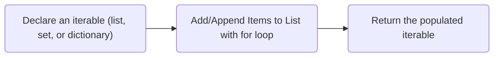
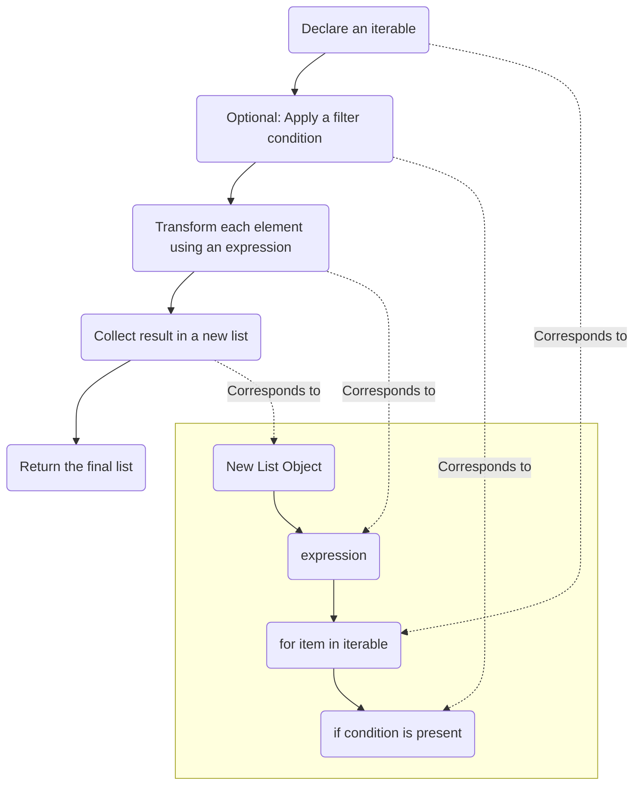

# Comprehensions

Python comprehensions are elegant, concise, and widely used. They can be used to create
[`lists`](../data_structures/lists.md), [`dicts`](../data_structures/dictionaries.md), and
[`sets`](../data_structures/sets.md). The most basic form is:

``` python {title="Basic Comprehensions" linenums="1"}
# General Form
# new_list = [<expression> for <item> in <iterable> if <condition>]
new_list = [x for x in range(10)]
new_set = {x for x in range(10)}
new_dict = {k:v for k,v in enumerate(range(10))}

print(f"New List: {new_list}")
print(f"New Set: {new_set}")
print(f"New Dict: {new_dict}")
```

Would result in:

``` text
New List: [0, 1, 2, 3, 4, 5, 6, 7, 8, 9]
New Set: {0, 1, 2, 3, 4, 5, 6, 7, 8, 9}
New Dict: {0: 0, 1: 1, 2: 2, 3: 3, 4: 4, 5: 5, 6: 6, 7: 7, 8: 8, 9: 9}
```

## Comprehensions vs `for` Loops

Comprehensions are a (simplified) form of a [`for` loop](for_loops.md). Both of these snippets
have the same result:

``` python {title="For Loop vs Comprehension" linenums="1"}
for_loop_result = []
for x in range(5):
    for_loop_result.append(x**2)

comprehension_result = [x**2 for x in range(5)]

print(f"For Loop Result: {for_loop_result}")
print(f"Comprehension Result: {comprehension_result}")
```

Outputs:

``` text
For Loop Result: [0, 1, 4, 9, 16]
Comprehension Result: [0, 1, 4, 9, 16]
```

Notice that the `for` loop required 3 lines, while the comprehension required just one. This isn't
only about brevity - many Python programmers find its also more readable.
`[x**2 for x in range(5)]` should be read as "append x<sup>2</sup> to a new list in the range of 0
to 5." x<sup>2</sup> is the *expression* (the body of the for loop), "x" is the item or *iterator*,
and "in range(5)" is the *iterable*.

Another way to think about this would be:



## Conditional Comprehensions

Additionally, it's possible to add an [`if` statement](if_statements.md) at the very end to make
the expression *conditional*.

``` python {title="Conditional Comprehensions" linenums="1"}
comprehension_result = [x**2 for x in range(10) if x % 2 == 0]
print(f"Comprehension Result: {comprehension_result}")
```

Resulting in:

``` text
Comprehension Result: [0, 4, 16, 36, 64]
```

This could be read as "append x<sup>2</sup> to a new list called 'comprehension_result',
if x is an even number, in the range of 0 to 10".  The order can be a little confusing,
but once understood, it is quite elegant.

## Comprehension Diagram

The diagram below goes into even more detail:


