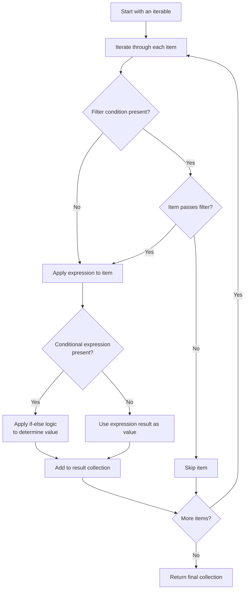

# Comprehensions

Python comprehensions are elegant, concise, and widely used constructs that allow you to create new data structures by transforming and filtering existing iterables. They provide a more readable and often more performant alternative to traditional loops. Comprehensions can be used to create [`lists`](../data_structures/lists.md), [`dictionaries`](../data_structures/dictionaries.md), and [`sets`](../data_structures/sets.md).

## Basic Comprehension Syntax

The most basic forms of comprehensions are:

``` python {title="Comprehension Syntax" linenums="1"}
# List comprehension
new_list = [expression for item in iterable]

# Set comprehension
new_set = {expression for item in iterable}

# Dictionary comprehension
new_dict = {key_expression: value_expression for item in iterable}
```

Here's a simple example of each:

``` python {title="Basic Comprehensions" linenums="1"}
new_list = [x for x in range(10)]
new_set = {x for x in range(10)}
new_dict = {k: v for k, v in enumerate(range(10))}

print(f"New List: {new_list}")
print(f"New Set: {new_set}")
print(f"New Dict: {new_dict}")
```

Output:
```text
New List: [0, 1, 2, 3, 4, 5, 6, 7, 8, 9]
New Set: {0, 1, 2, 3, 4, 5, 6, 7, 8, 9}
New Dict: {0: 0, 1: 1, 2: 2, 3: 3, 4: 4, 5: 5, 6: 6, 7: 7, 8: 8, 9: 9}
```

## Comprehensions vs For Loops

Comprehensions are essentially a condensed form of [`for` loops](for_loops.md) with automatic collection building. Both snippets below produce identical results:

``` python {title="Comprehensions vs For Loops" linenums="1"}
for_loop_result = []
for x in range(5):
    for_loop_result.append(x**2)

comprehension_result = [x**2 for x in range(5)]

print(f"For Loop Result: {for_loop_result}")
print(f"Comprehension Result: {comprehension_result}")
```

Output:
```text
For Loop Result: [0, 1, 4, 9, 16]
Comprehension Result: [0, 1, 4, 9, 16]
```

The comprehension is not only more concise (one line vs three), but many Python developers find it more readable and "Pythonic." The expression `[x**2 for x in range(5)]` reads naturally as "create a list of x-squared for each x in the range 0 to 4."

## Two Types of Conditional Logic

Comprehensions support two distinct types of conditional logic, which serve different purposes and have different syntax positions:

### 1. Filtering with `if`

Use filtering to determine **which items** to include in the result. The `if` condition comes **after** the `for` clause:

``` python {title="Filtering Comprehensions" linenums="1"}
# Syntax: [expression for item in iterable if condition]
even_squares = [x**2 for x in range(10) if x % 2 == 0]
print(f"Even squares: {even_squares}")
```

Output:
```text
Even squares: [0, 4, 16, 36, 64]
```

This reads as "create x-squared for each x in range 10, **but only if** x is even."

### 2. Conditional Expressions with `if-else`

Use conditional expressions to determine **what value** each item should have. The `if-else` expression comes **before** the `for` clause:

``` python {title="Conditionals Comprehensions" linenums="1"}
# Syntax: [value_if_true if condition else value_if_false for item in iterable]
grades = [85, 92, 78, 65, 98, 72]
results = ["Pass" if grade >= 70 else "Fail" for grade in grades]
print(f"Results: {results}")
```

Output:
```text
Results: ['Pass', 'Pass', 'Pass', 'Fail', 'Pass', 'Pass']
```

This reads as "for each grade, assign 'Pass' if grade >= 70, otherwise assign 'Fail'."

### Combining Both Patterns

You can use both filtering and conditional expressions in the same comprehension:

``` python {title="Combining Filtering and Conditionals in Comprehensions" linenums="1"}
categorized_evens = [
    "small" if x <= 5 else "large"
    for x in range(15)
    if x % 2 == 0
]
print(f"Categorized evens: {categorized_evens}")
```

Output:
```text
Categorized evens: ['small', 'small', 'small', 'large', 'large', 'large', 'large']
```

## List Comprehensions

List comprehensions are the most common type and create new lists by transforming existing
iterables:

``` python {title="List Comprehensions" linenums="1"}
words = ['apple', 'banana', 'cherry']
uppercase_words = [word.upper() for word in words]
print(f"Uppercase: {uppercase_words}")

students = [
    {'name': 'Alice', 'grade': 85},
    {'name': 'Bob', 'grade': 92},
    {'name': 'Charlie', 'grade': 78}
]
names = [student['name'] for student in students if student['grade'] >= 80]
print(f"High-performing students: {names}")
```

Output:
```text
Uppercase: ['APPLE', 'BANANA', 'CHERRY']
High-performing students: ['Alice', 'Bob']
```

## Set Comprehensions

Set comprehensions work identically to list comprehensions but use curly braces `{}` and
automatically eliminate duplicates:

``` python {title="Set Comprehensions" linenums="1"}
emails = ['user1@gmail.com', 'user2@yahoo.com', 'user3@gmail.com',
          'user4@outlook.com', 'user5@gmail.com', 'user6@yahoo.com']

unique_domains = {email.split('@')[1] for email in emails}
print(f"Unique domains: {unique_domains}")
```

Output:
```text
Unique domains: {'gmail.com', 'yahoo.com', 'outlook.com'}
```

## Dictionary Comprehensions

Dictionary comprehensions create key-value pairs and require both a key and value expression:

``` python {title="Dictionary Comprehensions" linenums="1"}
words = ['apple', 'banana', 'cherry', 'date', 'elderberry']
word_lengths = {word: len(word) for word in words}
print(f"Word lengths: {word_lengths}")

word_categories = {
    word: 'short' if len(word) <= 5 else 'long' # (1)
    for word in words
    if word.startswith(('a', 'e'))
}
print(f"Vowel words categorized: {word_categories}")

celsius_temps = {'morning': 20, 'noon': 25, 'evening': 18}
fahrenheit_temps = {
    time: (temp * 9/5) + 32
    for time, temp in celsius_temps.items()
}
print(f"Fahrenheit temps: {fahrenheit_temps}")
```

1. For readability, it is common practice to break dictionary comprehensions into multiple lines.

Output:
```text
Word lengths: {'apple': 5, 'banana': 6, 'cherry': 6, 'date': 4, 'elderberry': 10}
Vowel words categorized: {'apple': 'short', 'elderberry': 'long'}
Fahrenheit temps: {'morning': 68.0, 'noon': 77.0, 'evening': 64.4}
```

## Nested Comprehensions

Comprehensions can be nested to handle more complex data structures:

``` python {title="Nested Comprehensions" linenums="1"}
# Flatten a 2D matrix
matrix = [[1, 2, 3], [4, 5, 6], [7, 8, 9]]
flattened = [num for row in matrix for num in row]
print(f"Flattened matrix: {flattened}")

# Create a multiplication table
multiplication_table = {
    f"{i}x{j}": i * j
    for i in range(1, 4)
    for j in range(1, 4)
}
print(f"Multiplication table: {multiplication_table}")
```

Output:
```text
Flattened matrix: [1, 2, 3, 4, 5, 6, 7, 8, 9]
Multiplication table: {'1x1': 1, '1x2': 2, '1x3': 3, '2x1': 2, '2x2': 4, '2x3': 6, '3x1': 3, '3x2': 6, '3x3': 9}
```

## Best Practices & Common Patterns

**Use comprehensions:**

- Creating a new collection from an existing one
- The logic is simple and readable
- You need filtering and/or transformation in one step
- Performance matters (comprehensions are often faster than equivalent loops)

**Avoid comprehensions:**

- The logic becomes too complex or deeply nested
- Side effects are needed (printing, file I/O, etc.)
- The comprehension becomes difficult to read


``` python {title="Common Patterns for Comprehensions" linenums="1"}
# Pattern 1: Data extraction and transformation
data = [
    {'name': 'Alice', 'age': 25, 'city': 'NYC'},
    {'name': 'Bob', 'age': 30, 'city': 'LA'},
    {'name': 'Charlie', 'age': 35, 'city': 'Chicago'}
]

# Extract names of people over 25
mature_names = [person['name'] for person in data if person['age'] > 25]

# Pattern 2: String processing
text = "Hello World Python Programming"
word_lengths = {word.lower(): len(word) for word in text.split()}

# Pattern 3: Mathematical operations
coordinates = [(1, 2), (3, 4), (5, 6)]
distances = [x**2 + y**2 for x, y in coordinates]

# Pattern 4: Conditional categorization
numbers = range(1, 21)
number_types = {
    num: 'even' if num % 2 == 0 else 'odd'
    for num in numbers
    if num % 5 != 0  # Exclude multiples of 5
}

print(f"Mature names: {mature_names}")
print(f"Word lengths: {word_lengths}")
print(f"Distances: {distances}")
print(f"Number types: {number_types}")
```

## Comprehension Flow Diagram

