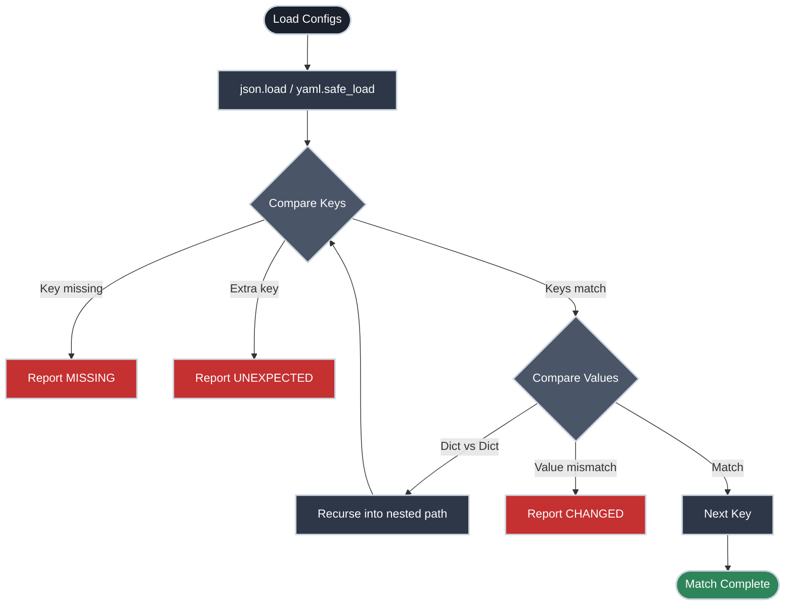

# Did the Config Change?

!!! tip "Part of Day One"
    This is part of [Day One: Python for Platform Engineers](overview.md).

You deployed. Something's slightly off — not broken enough to trigger alerts, but wrong. The service is responding but behavior has changed. Your first question: is the running configuration actually what you deployed?

`diff` works on files. But the config you care about might be a JSON response from an API, the output of `kubectl get configmap -o json`, or a YAML file that's gone through several hands. Python lets you compare the actual data, not the text representation.

---

## The `diff` Approach and Its Limits

```bash title="Comparing config files with diff" linenums="1"
diff expected.json actual.json
```

`diff` shows you line-by-line text differences. That means a key reordered in a JSON object looks like a change even when the values are identical. A YAML file with different indentation looks different even if it means the same thing. You end up chasing formatting noise instead of real drift.

Python parses the config into data, then compares the data.

---

## The Concept: Structural Comparison

Python's comparison logic ignores formatting and key order, focusing only on the data structure and values.



---

## Comparing Two JSON Files

```python title="compare_json.py" linenums="1"
import json
import sys


def load_json(path):
    with open(path) as f:
        return json.load(f)  # (1)!


def find_differences(expected, actual, path=""):
    """Return list of human-readable differences between two dicts."""
    differences = []
    all_keys = set(expected) | set(actual)  # (2)!

    for key in sorted(all_keys):
        location = f"{path}.{key}" if path else key

        if key not in actual:
            differences.append(f"MISSING:    {location}  (expected: {expected[key]!r})")
        elif key not in expected:
            differences.append(f"UNEXPECTED: {location}  (got: {actual[key]!r})")
        elif isinstance(expected[key], dict) and isinstance(actual[key], dict):
            differences.extend(find_differences(expected[key], actual[key], location))  # (3)!
        elif expected[key] != actual[key]:
            differences.append(f"CHANGED:    {location}")
            differences.append(f"            expected: {expected[key]!r}")
            differences.append(f"            got:      {actual[key]!r}")

    return differences


if __name__ == "__main__":
    if len(sys.argv) != 3:
        print(f"Usage: {sys.argv[0]} expected.json actual.json")
        sys.exit(1)

    expected = load_json(sys.argv[1])
    actual = load_json(sys.argv[2])

    diffs = find_differences(expected, actual)

    if diffs:
        print(f"✗ {len(diffs)} differences found:\n")
        for d in diffs:
            print(f"  {d}")
        sys.exit(1)
    else:
        print("✓ Configurations match")
```

1. `json.load(f)` parses the JSON file into Python data — dicts, lists, strings, numbers. Order doesn't matter; the data structure does.
2. `set(expected) | set(actual)` is the union of keys from both dicts — catches keys in expected but not actual (missing) and keys in actual but not expected (unexpected).
3. When both values are dicts, recurse into them. The `path` argument builds a dotted key path like `"database.connection.timeout"` so you know exactly where the difference is.

```bash title="Example output" linenums="1"
python compare_json.py expected.json actual.json
# ✗ 2 differences found:
#
#   CHANGED:    database.connection.timeout
#               expected: 30
#               got:      5
#   MISSING:    feature_flags.new_checkout
```

That second one — a feature flag gone missing — is exactly the kind of thing `diff` would bury in a sea of JSON formatting noise.

---

## Comparing YAML Files

The same approach works for YAML. You need the `pyyaml` package:

```bash title="Install pyyaml"
pip install pyyaml
```

```python title="compare_yaml.py" linenums="1"
import yaml
import sys


def load_yaml(path):
    with open(path) as f:
        return yaml.safe_load(f)  # (1)!


# ... rest is identical to the JSON version
```

1. `yaml.safe_load()` not `yaml.load()`. `safe_load` refuses to deserialize arbitrary Python objects, which `yaml.load()` will execute. Always use `safe_load` with files you didn't write yourself.

Once loaded, YAML becomes Python dicts and lists — the same `find_differences` function works on both.

---

## Comparing Against a Live API Response

Comparing a running service's config against what you expect — without a file on disk — is where this becomes a daily-use tool:

```python title="Compare expected file against live API" linenums="1"
import json
import requests
import sys

def load_json(path):
    with open(path) as f:
        return json.load(f)

def fetch_live_config(url):
    resp = requests.get(url, timeout=5)
    resp.raise_for_status()
    return resp.json()

expected = load_json("configs/expected.json")
actual = fetch_live_config("http://myapp.internal/api/config")

diffs = find_differences(expected, actual)
# ... same comparison logic
```

This is the workflow that catches config drift in a running system — not just after a deploy, but on a schedule or as part of a smoke test.

---

## Ignoring Fields You Don't Care About

Some fields change legitimately and you don't want to compare them — timestamps, instance IDs, build hashes:

```python title="Ignoring dynamic fields" linenums="1"
IGNORE_KEYS = {"last_updated", "instance_id", "build_hash"}

def find_differences(expected, actual, path=""):
    differences = []
    all_keys = (set(expected) | set(actual)) - IGNORE_KEYS  # (1)!

    for key in sorted(all_keys):
        # ... rest unchanged
```

1. Set subtraction removes the ignored keys from comparison. To add another field to ignore, edit the set.

Once you're comparing data instead of text, finding drift stops being a needle-in-haystack problem and starts being a script you run on a schedule.

---

## Practice Exercises

??? question "Exercise 1: Compare a Kubernetes ConfigMap"
    A Kubernetes ConfigMap can be exported with `kubectl get configmap myconfig -o json`. Write a script that compares the `data` section of two such exports.

    ??? tip "Answer"
        ```python title="Compare ConfigMap data sections" linenums="1"
        import json, sys

        def load_configmap_data(path):
            with open(path) as f:
                cm = json.load(f)
            return cm.get("data", {})  # (1)!

        expected = load_configmap_data(sys.argv[1])
        actual   = load_configmap_data(sys.argv[2])
        diffs = find_differences(expected, actual)
        ```

        1. `.get("data", {})` returns the `data` field if it exists, or an empty dict if it doesn't. Safer than `cm["data"]` which would raise a `KeyError` if the field is missing.

??? question "Exercise 2: Exit codes for CI integration"
    The script currently exits with code 1 if differences are found and 0 if not. Extend it so it exits 2 if it can't read one of the input files (e.g., file not found), distinct from a config mismatch.

    ??? tip "Answer"
        ```python title="Distinct exit codes" linenums="1"
        try:
            expected = load_json(sys.argv[1])
            actual   = load_json(sys.argv[2])
        except FileNotFoundError as e:
            print(f"✗ File not found: {e}")
            sys.exit(2)  # Distinct from comparison failure (1)
        except json.JSONDecodeError as e:
            print(f"✗ Invalid JSON: {e}")
            sys.exit(2)
        ```

---

## Quick Recap

| Concept | What It Does |
|:--------|:-------------|
| `json.load(f)` | Parse JSON file into Python dict/list |
| `yaml.safe_load(f)` | Parse YAML file into Python dict/list |
| `set(a) \| set(b)` | Union of keys from both dicts |
| `set(a) - IGNORE_KEYS` | Remove keys you don't want to compare |
| Recursive function | Walk nested dicts to find deep differences |
| `resp.json()` | Parse HTTP response body as JSON |

---

## What's Next

- **[Run This Everywhere](run_everywhere.md)** — When the config is right but you need to verify the same thing across your whole fleet

## Further Reading

### Official Documentation
- [`json` module](https://docs.python.org/3/library/json.html) — `json.load()`, `json.loads()`, `json.dump()`
- [`pyyaml` documentation](https://pyyaml.org/wiki/PyYAMLDocumentation) — `safe_load()` and why to use it

### Deep Dives
- [`deepdiff` library](https://pypi.org/project/deepdiff/) — A more complete solution for production config comparison tools, with type-aware comparison and configurable ignore rules

### Exploring Kubernetes
- [kubectl Commands](https://k8s.bradpenney.io/day_one/kubectl/commands/) — Extracting live config with `kubectl get configmap -o json` and `kubectl get deployment -o yaml`, which feed directly into the comparison scripts here
- [Understanding kubectl](https://k8s.bradpenney.io/day_one/kubectl/understanding/) — What kubectl is actually doing when it talks to the API server
