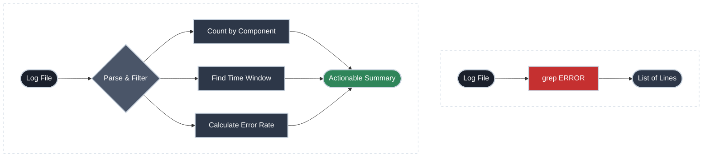

# What Just Broke?

!!! tip "Part of Day One"
    This is part of [Day One: Python for Platform Engineers](overview.md).

QA says the login flow is broken. You `ssh` to the app server and `tail -f` the log — it's moving fast, there are hundreds of ERROR lines, and you can't tell what's actually happening versus noise. `grep ERROR app.log | head -20` gives you 20 lines that could be anything.

You need to understand the failure, not just find it. That's the gap between `grep` and Python.

---

## The Concept: Finding vs. Understanding



---

## What `grep` Does Well (and Where It Stops)

```bash title="grep: finding errors" linenums="1"
grep ERROR /var/log/myapp/app.log
```

`grep` finds every line containing "ERROR". That's useful. But it doesn't answer:

- How many errors are there versus total log volume?
- Which component is producing them?
- When did they start? Did the count spike at a specific time?
- Is it one recurring error or twenty different ones?

To answer those questions in `bash` you're writing `awk`, accumulating into temp files, or running five separate commands. Python does it in one script you can keep and reuse.

---

## Start Simple: Count the Errors

```python title="count_errors.py" linenums="1"
import sys

log_file = sys.argv[1] if len(sys.argv) > 1 else "/var/log/myapp/app.log"

total_lines = 0
error_count = 0

with open(log_file) as f:  # (1)!
    for line in f:  # (2)!
        total_lines += 1
        if "ERROR" in line:
            error_count += 1

print(f"{error_count} errors in {total_lines} total lines")
if total_lines > 0:
    print(f"Error rate: {error_count/total_lines*100:.1f}%")
```

1. `with open(...)` automatically closes the file when the block exits — no need to call `f.close()`.
2. **Memory Efficient:** We iterate over the file one line at a time. This works on a 1KB file or a 10GB file without crashing your server.

!!! tip "Scaling to Giant Logs"
    Earlier tutorials often show `f.readlines()`, which reads the **entire file** into memory at once. For an SRE, this is a trap. A 5GB production log will immediately trigger an OOM (Out of Memory) killer on your app server. Always use `for line in f:` to process logs safely.

```bash title="Running it" linenums="1"
python count_errors.py /var/log/myapp/app.log
# 847 errors in 12,304 total lines
# Error rate: 6.9%
```

That one number already tells you something. 6.9% error rate on login is a problem. 0.01% might be acceptable noise.

---

## Find Which Component Is Failing

Most application logs follow a pattern. A common one:

```
2024-01-15 14:23:01 ERROR [AuthService] Token validation failed for user 4821
2024-01-15 14:23:01 INFO  [RequestRouter] GET /api/login 401
2024-01-15 14:23:02 ERROR [AuthService] Token validation failed for user 9334
2024-01-15 14:23:02 ERROR [DatabasePool] Connection timeout after 5000ms
```

The component name is in brackets. Pull it out:

```python title="errors_by_component.py" linenums="1"
from collections import Counter  # (1)!
import sys

log_file = sys.argv[1] if len(sys.argv) > 1 else "/var/log/myapp/app.log"

components = Counter()
error_count = 0

with open(log_file) as f:
    for line in f:
        if "ERROR" in line:
            error_count += 1
            try:
                component = line.split("[")[1].split("]")[0]  # (2)!
                components[component] += 1
            except IndexError:
                components["unknown"] += 1

print(f"\n{error_count} errors across {len(components)} components:\n")
for component, count in components.most_common():  # (3)!
    bar = "█" * min(count // 10, 40)
    print(f"  {component:25s} {count:5d}  {bar}")
```

1. `Counter` is a dictionary that counts things. `Counter()` starts empty; `counter[key] += 1` increments the count for that key. `most_common()` returns items sorted by count, highest first.
2. `line.split("[")` splits the string on `[`, giving a list. `[1]` takes the second element (after the first `[`). `.split("]")[0]` then takes the part before `]`. Brittle if the format changes, but effective for a consistent log format.
3. `most_common()` returns `(key, count)` pairs sorted by count descending — the worst offender is first.

```bash title="Output" linenums="1"
847 errors across 3 components:

  AuthService               821  ████████████████████████████████████████
  DatabasePool               24  ██
  RequestRouter               2
```

Now you know: it's almost entirely `AuthService`. The database pool errors are probably downstream. You know where to look.

---

## Find When the Errors Started

If your log lines start with a timestamp, you can find the first and last error window:

```python title="Find error window" linenums="1"
first_error = None
last_error = None
error_count = 0

with open(log_file) as f:
    for line in f:
        if "ERROR" in line:
            error_count += 1
            if not first_error:
                first_error = line[:19]
            last_error = line[:19]

if first_error:
    print(f"First error: {first_error}")
    print(f"Last error:  {last_error}")
    print(f"Error window: {error_count} errors between those timestamps")
```

Cross that timestamp against your deploy log and you know immediately whether the errors started with the deploy.

---

## Putting It Together

```python title="log_summary.py — full script" linenums="1"
from collections import Counter
import sys

def summarize_log(log_file):
    total_lines = 0
    error_count = 0
    first_error = None
    last_error = None
    components = Counter()

    with open(log_file) as f:
        for line in f:
            total_lines += 1
            if "ERROR" in line:
                error_count += 1
                if not first_error:
                    first_error = line[:19]
                last_error = line[:19]
                
                try:
                    component = line.split("[")[1].split("]")[0]
                    components[component] += 1
                except IndexError:
                    components["unknown"] += 1

    if error_count == 0:
        print(f"✓ No errors found in {total_lines} log lines")
        return

    rate = (error_count / total_lines * 100) if total_lines > 0 else 0
    print(f"✗ {error_count} errors in {total_lines} lines ({rate:.1f}%)")
    print(f"  First: {first_error}")
    print(f"  Last:  {last_error}")
    print(f"\nErrors by component:")
    for component, count in components.most_common():
        print(f"  {component:25s} {count}")

if __name__ == "__main__":
    if len(sys.argv) < 2:
        print(f"Usage: {sys.argv[0]} <log_file>")
        sys.exit(1)
    summarize_log(sys.argv[1])
```

This is a script you keep. Add it to your dotfiles or internal tooling repo. Run it on any structured log file.

---

!!! tip "Different log format?"
    Not every log uses `[ComponentName]`. If yours uses `key=value` pairs instead:

    ```python
    # Format: "2024-01-15T14:23:01Z level=ERROR component=AuthService message=..."
    parts = dict(p.split("=", 1) for p in line.split() if "=" in p)
    component = parts.get("component", "unknown")
    ```

    The extraction changes; the rest of the script stays the same.

---

## Practice Exercises

??? question "Exercise 1: Find the most common error message"
    Instead of grouping by component, group by the error message text. Use the same `Counter` approach, but extract the part of the line after the component name.

    ??? tip "Answer"
        ```python title="Group by message" linenums="1"
        messages = Counter()
        for line in errors:
            try:
                # "... ERROR [Component] The actual message here"
                after_bracket = line.split("]", 1)[1].strip()
                messages[after_bracket] += 1
            except IndexError:
                messages[line.strip()] += 1

        print("\nTop error messages:")
        for msg, count in messages.most_common(5):
            print(f"  {count:4d}  {msg[:80]}")
        ```

??? question "Exercise 2: Filter by time range"
    Modify the script to only count errors that occurred after a specific timestamp. For example: only errors after `2024-01-15 14:00:00`.

    ??? tip "Answer"
        ```python title="Time-filtered errors" linenums="1"
        cutoff = "2024-01-15 14:00:00"
        recent_errors = [
            line for line in errors
            if line[:19] >= cutoff  # (1)!
        ]
        ```

        1. ISO timestamps sort lexicographically — string comparison works correctly here as long as the format is consistent.

---

## Quick Recap

| Concept | What It Does |
|:--------|:-------------|
| `open(file)` + `for line in f:` | Read file one line at a time (memory efficient) |
| `line[:19]` | Extract fixed-width timestamp from start of line |
| `Counter` | Count occurrences of any key |
| `most_common()` | Return items sorted by count, highest first |
| `line.split("[")[1].split("]")[0]` | Extract text between brackets |

---

## What's Next

- **[Did the Config Change?](comparing_configs.md)** — When you suspect the error is configuration drift, not application code

## Further Reading

### Official Documentation
- [`collections.Counter`](https://docs.python.org/3/library/collections.html#collections.Counter) — The counting dictionary
- [Python file I/O](https://docs.python.org/3/tutorial/inputoutput.html#reading-and-writing-files) — `open()`, `readlines()`, `with` statement

### Deep Dives
- [Regular expressions in Python](https://docs.python.org/3/library/re.html) — For parsing log formats that aren't cleanly delimited by brackets or spaces (covered in depth in the Efficiency section)

### Exploring Linux
- [Reading Logs](https://linux.bradpenney.io/day_one/reading_logs/) — The Linux side: `journalctl`, `tail -f`, and navigating log files from the command line
- [grep](https://linux.bradpenney.io/essentials/grep/) — When your log parsing can stay in bash, `grep` is what you reach for first
