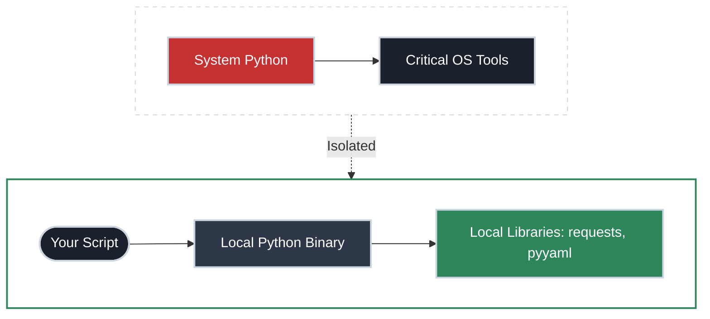

# The Clean Setup

!!! tip "Part of Day One"
    This is part of [Day One: Python for Platform Engineers](overview.md).

Before you write your first script, you need to fix a problem you might not know you have: **The System Python.**

Every Linux server and macOS machine comes with Python pre-installed. It's there for the operating system to use for its own tools (like `yum`, `apt`, or system update scripts). If you start installing your own libraries into the system Python, you risk breaking your OS.

The goal of this guide is to get you into a "Clean Room" environment where you can't break anything.

---

## The Concept: Isolation

A virtual environment acts as a protective layer between your automation scripts and your operating system.



---

## 1. Don't Use System Python

If you run `which python3` and it points to `/usr/bin/python3`, that's the system Python. 

**The Rule:** Never run `pip install` against the system Python. Always use a Virtual Environment (`venv`).

---

## 2. Creating Your First Virtual Environment

A virtual environment is just a folder that contains its own copy of the Python binary and its own `site-packages` folder (where libraries are installed). 

```bash title="Creating a venv" linenums="1"
# 1. Create a directory for your automation project
mkdir my-scripts && cd my-scripts

# 2. Create the virtual environment (commonly named .venv)
python3 -m venv .venv

# 3. "Activate" it
source .venv/bin/activate
```

Once activated, your prompt will usually change to show `(.venv)`. Now, when you run `python`, it uses the one inside that folder. When you run `pip install requests`, the library is saved into `.venv/`, not your system folders.

---

## 3. Dependency Management (The Requirements File)

In `bash`, if a script needs `jq`, you just hope it's installed or add a check for it. In Python, you document your requirements in a file so your teammates (and your CI/CD pipeline) can replicate your environment exactly.

```bash title="Managing dependencies" linenums="1"
# Install a library
pip install requests

# Save your current environment state
pip freeze > requirements.txt
```

When your teammate clones your repo, they just run:
`pip install -r requirements.txt`

---

## 4. The REPL: Your Scratchpad

The REPL (Read-Eval-Print Loop) is what you get when you just type `python` (or `python3`) and hit enter. It's the equivalent of running commands directly in your terminal before putting them in a `.sh` file.

**Use the REPL when:**
- You aren't sure what a JSON response looks like
- You want to test a regex pattern
- You need to see if a specific `import` works

```python title="Testing in the REPL"
>>> import requests
>>> resp = requests.get("https://api.github.com/zen")
>>> resp.text
'Design for failure.'
```

---

## 5. Summary Checklist

| Action | Why |
|:-------|:----|
| **Use `venv`** | Protects your OS from library conflicts |
| **`pip freeze > requirements.txt`** | Ensures your script runs in CI/CD exactly as it did locally |
| **Use the REPL** | Fast feedback loop for testing logic fragments |
| **Add `.venv/` to `.gitignore`** | Never commit the environment itself, only the instructions to build it |

---

## What's Next

Now that your environment is clean, let's decide when to actually use it:

- **[Why Python (Not Just Bash)](why_python.md)** — The decision framework for platform engineers.
