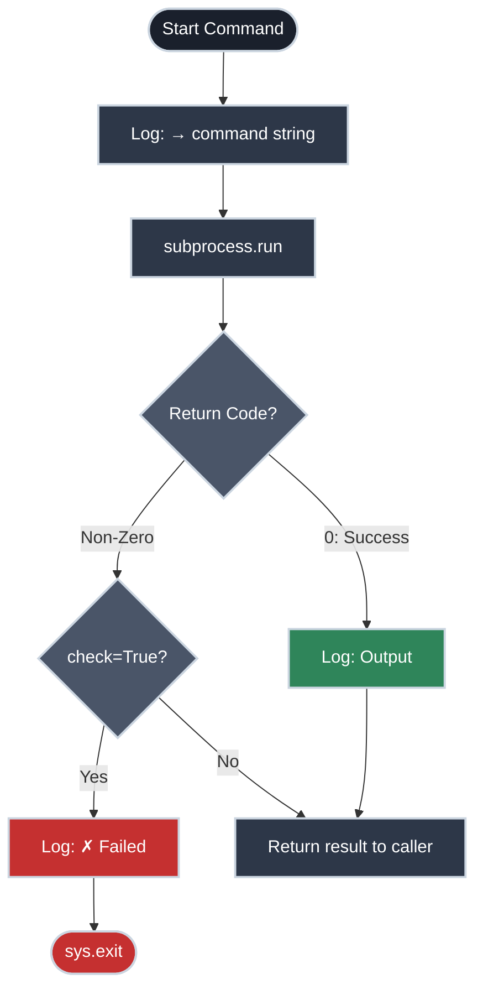

# My Bash Script Is Getting Out of Hand

!!! tip "Part of Day One"
    This is part of [Day One: Python for Platform Engineers](overview.md).

You've got a deploy script. It started as 15 lines. Now it's 80 lines, it has nested `if` statements, error handling is a mess of `|| exit 1` chained everywhere, and your teammate asked what it does and you spent 10 minutes explaining it.

The commands themselves are fine. It's the logic around them that's the problem.

Python lets you keep running the exact same shell commands while giving you real control flow, proper error handling, and code that reads like what it's doing.

---

## The Concept: The `run()` Wrapper

The `run()` wrapper handles the repetitive boilerplate of execution, logging, and error checking so your deployment logic stays clean.



---

## The Pattern: A `run()` Wrapper

The core of wrapping shell commands in Python is a single reusable function:

```python title="The run() function" linenums="1"
import subprocess
import sys


def run(command, check=True, capture=False):
    """Run a shell command.

    Prints the command before running it. Exits on failure unless check=False.
    Returns the CompletedProcess result.
    """
    print(f"→ {' '.join(command)}")

    result = subprocess.run(
        command,
        text=True,
        capture_output=capture,
    )

    if result.stdout and capture:
        pass  # caller handles the output
    elif result.stdout:
        print(result.stdout.rstrip())

    if result.returncode != 0:
        if result.stderr:
            print(result.stderr.rstrip(), file=sys.stderr)
        if check:
            print(f"\n✗ Command failed (exit {result.returncode}): {' '.join(command)}")
            sys.exit(result.returncode)  # (1)!

    return result
```

1. Exiting with `result.returncode` rather than always `sys.exit(1)` preserves the original exit code, which matters if something is calling your script and checking why it failed.

!!! warning "Gotcha: The Shell Environment"
    When you run a command via `subprocess.run()`, Python starts a **new process**. It inherits your environment variables (`PATH`, `USER`, etc.), but it **does not** load your `.bashrc`, `.zshrc`, or shell aliases.

    - **Aliases won't work:** If you have `alias k=kubectl`, `run(["k", "get", "pods"])` will fail. Always use the full command name.
    - **Shell functions won't work:** If you've defined a bash function in your profile, Python won't see it.
    - **PATH matters:** If `kubectl` is in a non-standard location not in your `PATH`, you'll need to use the absolute path or update `os.environ["PATH"]` in your script.

With this function, your deploy script becomes readable:

```python title="deploy.py — using run()" linenums="1"
def deploy(environment, image_tag):
    print(f"\n=== Deploying {image_tag} to {environment} ===\n")

    run(["kubectl", "apply", "-f", f"manifests/{environment}/"])  # (1)!

    run(["kubectl", "rollout", "status",
         "deployment/myapp",
         f"--namespace={environment}",
         "--timeout=120s"])

    run(["kubectl", "get", "pods",
         f"--namespace={environment}",
         "-l", "app=myapp"])

    print(f"\n✓ Deploy complete: {image_tag} → {environment}")


deploy("staging", "myapp:v1.4.2")
```

1. The image tag lives in the manifests directory — update the manifest, commit it, then deploy. `kubectl apply -f` deploys whatever is in `manifests/staging/`. Never use `kubectl set image` to mutate a running deployment directly.

Every command is logged before it runs. Every failure stops the script and shows you what failed. The logic reads like a deployment runbook.

---

## Capturing Output When You Need It

Sometimes you need to use the output of a command in your script:

```python title="Capturing command output" linenums="1"
result = run(
    ["kubectl", "get", "deployment", "myapp",
     "-o", "jsonpath={.status.readyReplicas}"],
    capture=True
)

ready_replicas = int(result.stdout.strip())
print(f"Ready replicas: {ready_replicas}")

if ready_replicas < 3:
    print(f"✗ Expected 3 ready replicas, got {ready_replicas}")
    sys.exit(1)
```

In `bash` this is `$(kubectl get ...)` inside an `if`. Fine for one level. Python scales better when you need to parse, compare, or do arithmetic with the result.

---

## Handling Failures Selectively

Not every failed command should stop the script. Sometimes you want to try something, check if it worked, and handle each case:

```python title="Conditional failure handling" linenums="1"
# Check if the namespace exists before trying to create it
result = run(
    ["kubectl", "get", "namespace", "myapp-staging"],
    check=False,    # don't exit on failure
    capture=True,
)

if result.returncode != 0:
    print("Namespace doesn't exist — creating it")
    run(["kubectl", "create", "namespace", "myapp-staging"])
else:
    print("Namespace already exists")
```

In `bash` this is `if kubectl get namespace ... 2>/dev/null; then`. Python is cleaner, and you don't have to remember to redirect stderr.

---

## Avoiding `shell=True`

You may have seen `subprocess.run("kubectl apply -f manifests/", shell=True)`. Avoid it.

`shell=True` passes the command string to `/bin/sh`, which means shell metacharacters (`$`, `;`, `&&`, etc.) are interpreted. If any part of that string contains a variable you didn't control, you have a code injection risk.

```python title="shell=True vs list form" linenums="1"
# ❌ shell=True — vulnerable if namespace comes from user input or env
run_bad = subprocess.run(
    f"kubectl apply -f manifests/ --namespace={namespace}",
    shell=True
)

# ✅ List form — each argument is passed directly, no shell interpretation
run_good = subprocess.run(
    ["kubectl", "apply", "-f", "manifests/", f"--namespace={namespace}"]
)
```

The list form is always safe. The only time you genuinely need `shell=True` is when you're using shell built-ins or piping (`|`) that can't be restructured. In those cases, use it explicitly and comment why.

---

## A Complete Deployment Script

```python title="deploy.py — full example" linenums="1"
import subprocess
import sys
import click


def run(command, check=True, capture=False):
    print(f"→ {' '.join(command)}")
    result = subprocess.run(command, text=True, capture_output=capture)
    if result.stdout and not capture:
        print(result.stdout.rstrip())
    if result.returncode != 0:
        if result.stderr:
            print(result.stderr.rstrip(), file=sys.stderr)
        if check:
            print(f"\n✗ Failed: {' '.join(command)}")
            sys.exit(result.returncode)
    return result


def deploy(env, tag, dry_run=False):
    print(f"\n{'[DRY RUN] ' if dry_run else ''}Deploying {tag} → {env}\n")

    steps = [
        ["kubectl", "apply", "-f", f"manifests/{env}/"],
        ["kubectl", "rollout", "status", "deployment/myapp",
         f"--namespace={env}", "--timeout=120s"],
    ]

    for step in steps:
        if dry_run:
            print(f"→ [DRY RUN] {' '.join(step)}")
        else:
            run(step)


@click.command()
@click.argument("environment", type=click.Choice(["staging", "production"]))
@click.argument("tag")
@click.option("--dry-run", is_flag=True, help="Print commands without running them")
def main(environment, tag, dry_run):
    deploy(environment, tag, dry_run=dry_run)


if __name__ == "__main__":
    main()
```

```bash title="Using the deploy script" linenums="1"
# Show what would happen
python deploy.py staging myapp:v1.4.2 --dry-run

# Actually deploy
python deploy.py staging myapp:v1.4.2
```

This is the scaffold for every deploy script you'll write. Start here and add what your deploy actually needs.

!!! tip "Make It Actionable"
    Don't let these scripts sit in your `Downloads` folder. 
    1. Create a `scripts/` directory in your project or a central `~/bin/` folder.
    2. Add these to your team's internal tooling repo.
    3. Use the `--dry-run` flag as your default way to test changes before they touch production.

---

## Practice Exercises

??? question "Exercise 1: Add a rollback command"
    Extend the deploy script with a `--rollback` flag. When `--rollback` is passed, run `kubectl rollout undo deployment/myapp` instead of the normal deploy steps.

    ??? tip "Answer"
        ```python title="Rollback flag" linenums="1"
        @click.command()
        @click.argument("environment", type=click.Choice(["staging", "production"]))
        @click.argument("tag")
        @click.option("--dry-run", is_flag=True, help="Print commands without running them")
        @click.option("--rollback", is_flag=True, help="Roll back to previous deployment")
        def main(environment, tag, dry_run, rollback):
            if rollback:
                run(["kubectl", "rollout", "undo", "deployment/myapp",
                     f"--namespace={environment}"])
            else:
                deploy(environment, tag, dry_run=dry_run)
        ```

??? question "Exercise 2: Log every command to a file"
    Modify the `run()` function so every command and its output is written to a timestamped log file in addition to printing to the terminal.

    ??? tip "Answer"
        ```python title="Logging to file" linenums="1"
        import datetime

        LOG_FILE = f"deploy_{datetime.date.today()}.log"

        def run(command, check=True, capture=False):
            cmd_str = ' '.join(command)
            print(f"→ {cmd_str}")
            with open(LOG_FILE, "a") as log:
                log.write(f"[{datetime.datetime.now().isoformat()}] {cmd_str}\n")

            result = subprocess.run(command, text=True, capture_output=True)

            if result.stdout:
                print(result.stdout.rstrip())
                with open(LOG_FILE, "a") as log:
                    log.write(result.stdout)

            # ... rest of the function
        ```

---

## Quick Recap

| Concept | What It Does |
|:--------|:-------------|
| `subprocess.run([...])` | Run a command; returns a `CompletedProcess` |
| `text=True` | Decode stdout/stderr as strings (not bytes) |
| `capture_output=True` | Capture stdout/stderr instead of printing |
| `result.returncode` | 0 = success, non-zero = failure |
| `check=False` | Don't exit on failure — let caller decide |
| `shell=True` | Avoid unless you need shell features; injection risk |

---

## What's Next

- **[The "Don't Do This" Guide](safety_guide.md)** — Security and safety rules before you run any of this in production

## Further Reading

### Official Documentation
- [`subprocess` module](https://docs.python.org/3/library/subprocess.html) — Complete reference for `subprocess.run`, `Popen`, and related
- [`click`](https://click.palletsprojects.com/) — Building proper CLI interfaces (covered in depth in the Efficiency section)

### Deep Dives
- [subprocess security considerations](https://docs.python.org/3/library/subprocess.html#security-considerations) — The official docs on `shell=True` risks

### Exploring Linux
- [Pipes and Redirection](https://linux.bradpenney.io/essentials/pipes_and_redirection/) — The bash patterns this article replaces: `|`, `>`, `2>&1`, and why Python handles them more cleanly
- [Command Line Fundamentals](https://linux.bradpenney.io/essentials/command_line_fundamentals/) — The foundation this article assumes you already have
