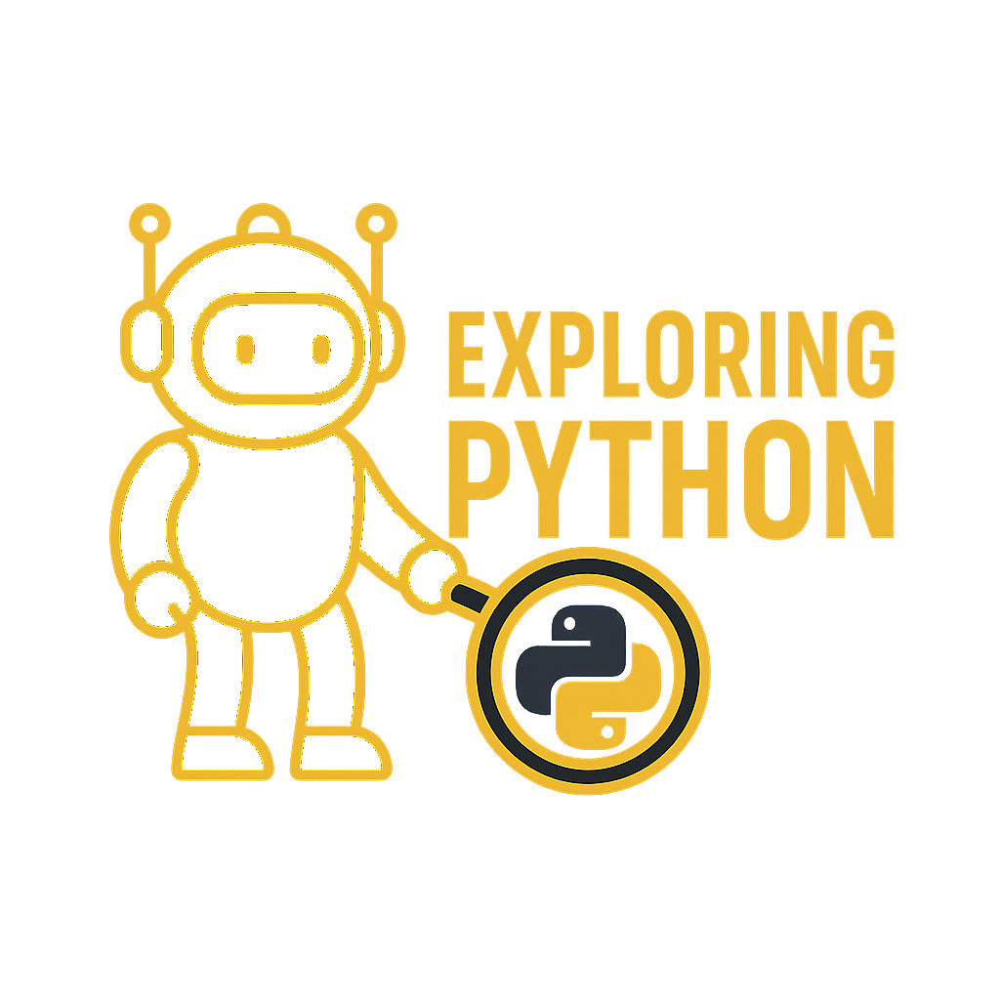

# Exploring Python

You automate things. Bash has served you well — it's the right tool for one-liners, pipelines, and quick shell glue. But somewhere around the third time you've rewritten the same 60-line deploy script because error handling got too complicated, you need something that scales with you.

This site is Python for people who already know how to work in a terminal. Not a programming primer. Not syntax drills. Real automation tasks, organized by the problem you're trying to solve.

## Who This Is For

You work in platform engineering, infrastructure, SRE, or DevOps. You know `bash`. You've probably got a folder of scripts that "mostly work." You need Python to be useful — not eventually, right now.

You don't need to know what a decorator is before you can write a health-check poller. You don't need to understand generators before you can parse a log file.

This site starts with the task. The Python comes with it.

## What You'll Learn to Do

| Problem | Where It Lives |
|:--------|:--------------|
| Check if an API recovers during a redeploy | [Day One → "Is It Still Up?"](day_one/health_check.md) |
| Find what's breaking from a 10MB log file | [Day One → "What Just Broke?"](day_one/parsing_logs.md) |
| Verify a running config matches what you deployed | [Day One → "Did the Config Change?"](day_one/comparing_configs.md) |
| Run a check across your whole fleet | [Day One → "Run This Everywhere"](day_one/run_everywhere.md) |
| Migrate a `bash` script that's gotten too complex | [Day One → "My Bash Script Is Getting Out of Hand"](day_one/wrapping_bash.md) |
| Load credentials without hardcoding them | [Essentials → Environment Variables and Secrets](essentials/env_and_secrets.md) |
| Read and modify Kubernetes manifests in Python | [Essentials → Working with YAML](essentials/yaml.md) |
| Build a CLI tool your team can actually use | Efficiency → `click` *(coming soon)* |
| Package and distribute your automation tools | Mastery → Packaging *(coming soon)* |

## The Path

=== "🐍 Day One"

    For engineers who need Python to solve a specific problem today. Each article starts with a real scenario, shows the Python solution, and explains just enough to understand what's happening.

    **Persona:** Platform engineer who knows `bash`, needs Python working now.

    **Tone:** Practical. No hand-holding on basic programming concepts.

    [Start with the Overview →](day_one/overview.md)

=== "📦 Essentials"

    Core Python patterns for engineers who've done Day One and want to write better, more maintainable automation. Deeper coverage of the tools you'll reach for every day.

    **Persona:** Engineer who can write basic scripts, wants to level up.

    - [Environment Variables and Secrets](essentials/env_and_secrets.md) — Loading credentials at runtime, `.env` files, failing fast on missing vars
    - [Working with YAML](essentials/yaml.md) — Reading, modifying, and generating Kubernetes manifests

=== "⚡ Efficiency"

    Professional-grade Python: CLI tools with `argparse`, proper logging, testing your automation, building things your team can actually use.

    **Persona:** Working platform engineer shipping Python to production.

    *Coming soon.*

=== "🎯 Mastery"

    Production Python: packaging tools for distribution, internal APIs with FastAPI, async operations, the Kubernetes Python client.

    **Persona:** Senior SRE responsible for Python automation infrastructure.

    *Coming soon — and eventually paywalled.*

---

If `bash` is getting in your way, start with [Day One](day_one/overview.md).
