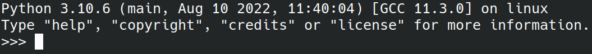
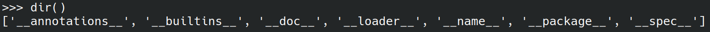
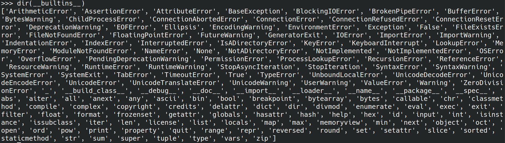
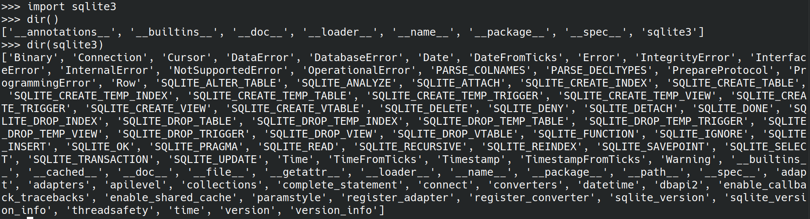
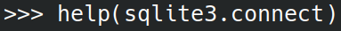
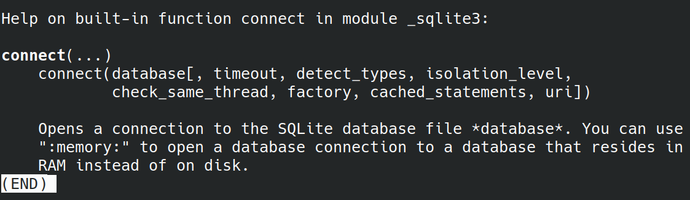

.. role:: p(code)
   :language: python

Modules & Packages
==================

.. toctree::
   :maxdepth: 1
   :caption: Section Contents
   
   coreModules/index
   pythonPackages/index
   
Page Contents
-------------

- :ref:`Importing Modules and Packages`
- :ref:`Run Code Explicitly`
- :ref:`Python's Built-In Documentation`

In a standard installation of Linux, Python can be found at :p:`/usr/bin/python3`.  Python is actually written in the :p:`C` programming language (by `Guido van Rossum <https://en.wikipedia.org/wiki/Guido_van_Rossum>`_).

The `Python Documentation <https://docs.python.org/3/>`_ website contains information about all the amazing functionality that is built into the Python programming language.

The `Python Package Index (PyPI) <https://pypi.org/>`_ helps you find and intall Python packages developed and shared by the Python community.

Importing Modules and Packages
------------------------------

To import any module or package, simply add the import statement at the top of the Python file.  For example:

.. code-block:: python

      import logging as l

The :p:`as l` part of this statement is purely programmer convenience, as :p:`l` can now be appended to the beginning of any :p:`logging` function, saving a few keystrokes and possibly making the code more legible for other programmers.

Run Code Explicitly
-------------------

When importing a module or package at the top of a program, it is important to know that Python runs the code being imported when it encounters that line.  This could have disasterous results if the imported code generated unexpected output, seemingly without being called.

To safeguard against this, most programmers use a simple convention so that the main function of any program will only run if it is explicitly called or the program is being run directly via Python (not being imported).  The line is simply:

.. code-block:: python

      if __name__ == '__main__':
            main() # Also a convention, could be called something different!

When an application is run, Python generates a name for the program and stores it in the :p:`__name__` variable.  By default, this is :p:`__main__`.  Therefore, when imported a module or package should generate nothing, but rather initialize the included functions/classes so they can be used by the program importing them.  

For more information, please watch Corey Schafer's excellent explanation:

.. figure:: https://img.youtube.com/vi/sugvnHA7ElY/maxresdefault.jpg
    :width: 500
    :alt: Corey Schafer - Python Tutorial: :p:`if  __name__ == '__main__'`
    :target: https://youtu.be/sugvnHA7ElY

    Corey Schafer - Python Tutorial: :p:`if  __name__ == '__main__'`

Python's Built-In Documentation
-------------------------------

Python has significant documentation built into the language.  This can be accessed using the Python Integrated Development and Learning Environment (IDLE).  In Linux, this is accessed by opening the terminal application and running the :p:`python3` command:

      Python IDLE via Command Line

Once inside the IDLE prompt, there are built-in commands that allow a developer to explore how parts of the Python language works.  The :p:`dir()` method gives a starting point for exploration:

      Exploring Python using :p:`dir()`

Calling the :p:`dir()` method on any of these components shows the available objects, classes and methods that Python contains.  For example, :p:`dir(__builtins__)` looks like this:

      Exploring Python Built-Ins using :p:`dir(__builtins__)`

Once a core module is imported, it is also available to be examined.  For example, after importing the :p:`sqlite3` module, it appears in the :p:`dir()` call, and can examined thoroughly:

      Exploring the SQLite3 Core Module using :p:`dir(sqlite3)`

If deeper investigation into a Python object is required, the :p:`help()` function is used:

      Exploring the SQLite3 Connect Function using :p:`help()`

Which results in very helpful documentation:

      Built-In Documentation about the SQLite3 Connect Function
